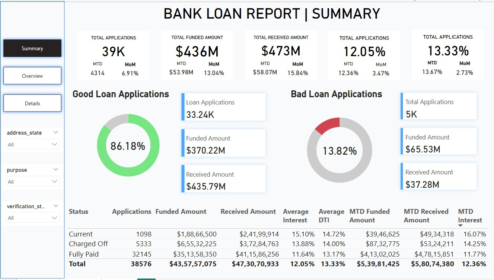
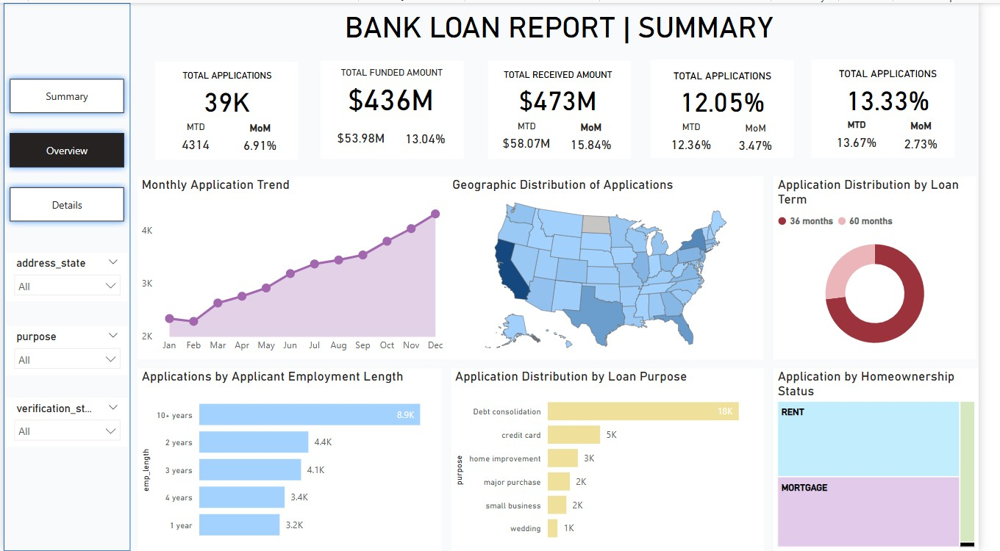
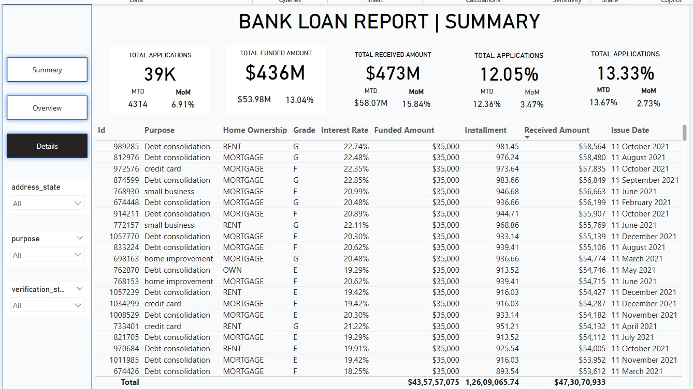

# Bank-Loan-Portfolio-Risk-Performance-Analysis-

Here’s a well-structured **README.md** you can use for your GitHub post for this project.
It is based on your PBIX file, screenshots, `Terminologies` doc, `Domain Knowledge` doc, and the CSV file you uploaded.

---

# 📊 Bank Loan Analysis Dashboard

This project is an **interactive Power BI dashboard** designed to analyze and visualize bank loan data. It helps banks, financial analysts, and decision-makers monitor loan performance, assess risk, and gain actionable insights from large volumes of loan data.

## 📌 Project Highlights

* Built using **Power BI Desktop (.pbix)**
* Data source: CSV file containing **39K bank loan applications**
* Pages included:

  * Summary Dashboard
  * Overview Dashboard
  * Detailed Loan Records

## 🎯 Purpose

The goal of this dashboard is to enable:

* Better **credit risk management**
* Improved **loan portfolio monitoring**
* Enhanced **customer insights**
* Automated **regulatory reporting**
* Faster and more informed **decision-making**

## 🗂️ Project Structure

| Section  | Description                                                               |
| -------- | ------------------------------------------------------------------------- |
| Summary  | Shows overall metrics and % of Good vs Bad loans                          |
| Overview | Trends by geography, loan term, purpose, employment length, homeownership |
| Details  | Full loan records with filters for deep dive                              |

## 📊 Key Metrics Visualized

* Total Applications
* Total Funded Amount
* Total Received Amount
* Interest Rates (MTD, MoM)
* Good Loan % vs Bad Loan %
* Application trends (Monthly)
* Geographic heatmaps
* Applications by Purpose, Homeownership, Employment Length, and Term

## 📚 Domain Knowledge

### What is Bank Loan Data?

Bank loan data includes information captured through the lifecycle of a loan—from application to repayment or charge-off. The fields analyzed here include:

* Loan ID
* Purpose
* Address State
* Employment Length
* Homeownership
* Grade & Subgrade
* Interest Rate
* Funded & Received Amounts
* Installment
* DTI (Debt-to-Income ratio)
* Verification Status
* Loan Status (Current, Fully Paid, Charged Off)
* Issue Date, Last Payment Date, Next Payment Date

### Why Analyze Bank Loan Data?

* **Risk assessment:** Identify default risks
* **Portfolio management:** Monitor loan performance
* **Fraud detection:** Detect unusual patterns
* **Compliance:** Generate regulatory reports (KYC, HMDA)
* **Customer insights:** Improve loan offerings
* **Profitability analysis:** Evaluate margins and income

For full details, refer to the included docs:

* [`Terminologies in Data`](Terminologies%20in%20Data%20%281%29.docx)
* [`Domain Knowledge`](Domain%20Knowledge%20Doc%20%282%29.docx)

## 🚀 How to Use

1. Clone/download this repo
2. Open `BankLoanAnalysis.pbix` in **Power BI Desktop**
3. Connect to `financial_loan.csv` (already embedded) if needed
4. Explore each dashboard tab:

   * Summary
   * Overview
   * Details
5. Apply filters (`State`, `Purpose`, `Verification Status`) to drill down

## 🖼️ Sample Screenshots

### Summary Dashboard

### Overview Dashboard

### Detailed Records

## 📊 Insights Example

* **Good Loan Applications**: 86.18% of loans
* **Bad Loan Applications**: 13.82%
* Most loans are for **Debt Consolidation**
* Highest volume of applications from **California (CA)**
* Loans with **10+ years of employment** have higher approval rates

## 🛠️ Tools & Tech

* Power BI Desktop
* Power Query (ETL)
* DAX for calculated columns & measures
* CSV dataset of 39,000+ records

## 📜 License

For personal learning and demo purposes only.
Data copyright: Data Tutorials
